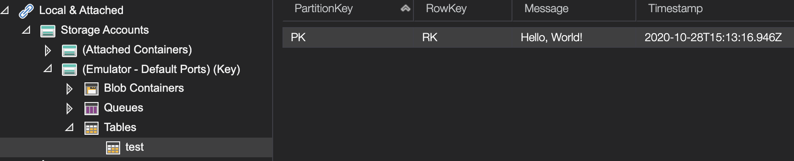

# TableStorageLocal

[](https://www.nuget.org/packages/TableStorageLocal/)


TableStorageLocal is an Azure Table Storage compatible emulator, like [Azurite](https://github.com/Azure/Azurite), but built using .NET and the awesome [LiteDB](https://www.litedb.org/) so it can run in memory with your tests, or as a standalone process/Docker container if you need to persist your data.

### Getting Started

Create a `LocalTables` instance then use the `ConnectionString` property to create a `CloudTableClient`

```csharp
var tables = new LocalTables();
var client = CloudStorageAccount.Parse(tables.ConnectionString).CreateCloudTableClient();
var table = client.GetTableReference("test");
table.CreateIfNotExists();
var entity = new DynamicTableEntity("PK", "RK", "*", new Dictionary<string, EntityProperty>() { { "Message", EntityProperty.GeneratePropertyForString("Hello, World!") } });
table.Execute(TableOperation.Insert(entity));
var result = table.Execute(TableOperation.Retrieve("PK", "RK"));
Console.WriteLine(((DynamicTableEntity)result.Result).Properties["Message"]);
```

Use a [LiteDB connection string](https://www.litedb.org/docs/connection-string/) to enable persistance:
```csharp
var tables = new LocalTables("mydata.db")
```

Combine this with the default local storage port, and you can browse and edit your data using [Azure Storage Explorer](https://azure.microsoft.com/en-us/features/storage-explorer/)
```csharp
var tables = new LocalTables("mydata.db", 10002)
```



#### Docker image

The Azurite example can be run as a docker image:

```
docker run -d -p 10002:10002  --name tablestoragelocal craftyfella/tablestoragelocal:latest
```
